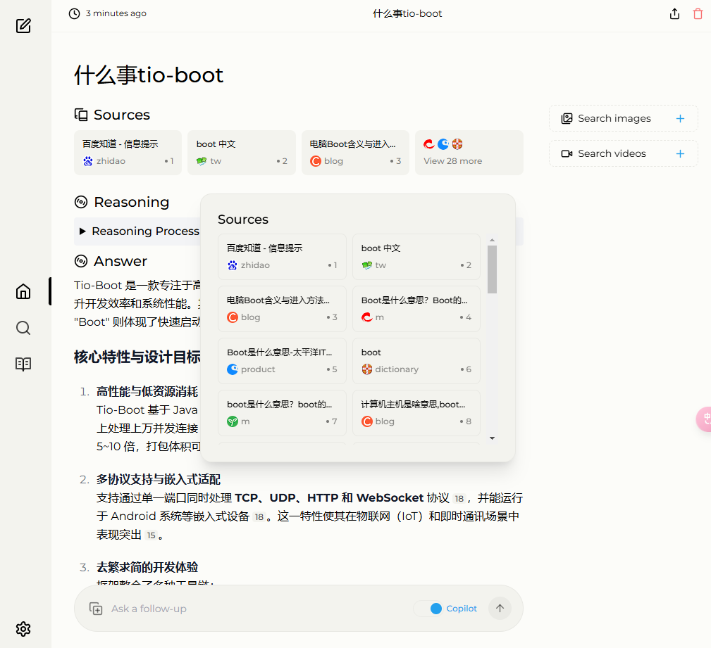
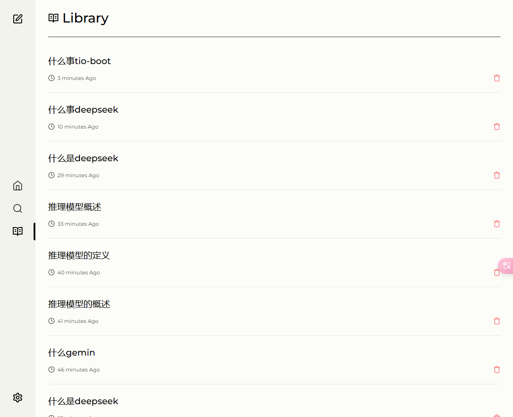

# Max-Search

**Max-Search** 是一个基于 AI 搜索的项目，由 **大语言模型（Deepseek r1）** 与 **搜索引擎（TAVILY）** 组合而成，旨在为用户提供强大的语义搜索与智能问答体验。

## 演示地址
- [Max-Search 在线演示](http://www.maxsearch.ai/)

## 演示界面
以下是 Max-Search 的部分界面示例（图片仅供参考）：
- 
- 

## 项目简介
- **后端开源地址**：[max-search 后端](https://github.com/litongjava/max-search)
- **前端开源地址**：[Perplexica（java-max-search 分支）](https://github.com/litongjava/Perplexica/tree/java-max-search)

Max-Search 项目以 AI 搜索为核心，结合自然语言处理与搜索引擎技术，为用户提供以下能力：
1. **语义搜索**：通过大语言模型 Deepseek r1，实现对文本、问题的语义理解与精准匹配。
2. **多种搜索源**：整合 Tavily、SearxNG 等搜索引擎，支持多源数据检索。
3. **智能问答**：结合 Jina Reader API、Jina Search API，可对搜索结果进行重排、摘要与推理，给出更具价值的答案。
4. **多格式文档处理**：支持 PDF、网页等多种格式文件的解析、搜索与阅读。
5. **搜索历史记录**：保存用户搜索历史，便于后续分析和复用。
6. **意图识别**：自动识别用户查询意图，进行问题重写或问法优化，提升搜索效率与问答准确度。
7. **问答推理**：基于深度学习模型，对用户提出的问题进行推理回答，支持多轮对话及复杂问题分析。

## 项目功能概览
- **TCP、UDP、HTTP 及 WebSocket** 等多种通信方式接口，满足多场景下的实时或异步调用需求。
- **深度推理问答**：基于火山引擎 DeepSeek 等模型进行上下文语义分析、逻辑推理与结果生成。
- **搜索重排**：利用深度学习模型对初步搜索结果进行重排，优先展示更符合用户意图的结果。
- **生成建议问**：对用户输入进行分析，智能生成与其意图相关的其他可能问题。
- **生成问题标题**：针对输入的长文本或复杂问题，自动生成简明扼要的标题。
- **多种部署方式**：可通过 jar 包或 Docker 进行快速部署。

## 环境与依赖
1. **JDK** 版本要求：Java 8 及以上。
2. **Maven** 或 **Gradle** 构建工具（根据项目配置）。
3. **前端** 采用 Vue 或其他常见框架（详见 [Perplexica 前端仓库](https://github.com/litongjava/Perplexica/tree/java-max-search)）。
4. **数据库**：支持多种数据库类型（参考 [ai-search 数据库文档](https://www.tio-boot.com/zh/64_ai-search/02.html)），如需要可进行自定义配置。
5. **其他依赖**：请参阅各自模块下的 `pom.xml` 或 `package.json` 进行安装。

## 快速开始
1. **克隆项目**
   ```bash
   git clone https://github.com/litongjava/max-search.git
   ```
2. **进入项目目录**，并按照需求进行配置：
   - 修改 `application.yml` 或 `application.properties` 文件，配置搜索源、数据库连接等信息。
3. **构建并运行后端**：
   ```bash
   # 进入 max-search 目录后
   mvn clean install
   java -jar target/max-search-0.0.1-SNAPSHOT.jar
   ```
4. **克隆并启动前端**（如有需要）：
   ```bash
   git clone https://github.com/litongjava/Perplexica.git
   # 切换到 java-max-search 分支
   git checkout java-max-search
   # 安装依赖并启动
   npm install
   npm run serve
   ```
5. **访问演示地址**：默认情况下，后端会在 `http://localhost:8080/` 启动服务，前端会在 `http://localhost:3000/`（或其他端口）提供可视化界面。

## 主要文档与链接
以下文档为你提供了更多关于 Max-Search 及其子模块的介绍和使用说明：

1. [AI-Search 项目简介](https://www.tio-boot.com/zh/64_ai-search/01.html)  
2. [AI-Search 数据库文档](https://www.tio-boot.com/zh/64_ai-search/02.html)  
3. [AI-Search SearxNG 搜索引擎](https://www.tio-boot.com/zh/64_ai-search/03.html)  
4. [AI-Search Jina Reader API](https://www.tio-boot.com/zh/64_ai-search/04.html)  
5. [AI-Search Jina Search API](https://www.tio-boot.com/zh/64_ai-search/05.html)  
6. [AI-Search 搜索、重排与读取内容](https://www.tio-boot.com/zh/64_ai-search/06.html)  
7. [AI-Search PDF 文件处理](https://www.tio-boot.com/zh/64_ai-search/07.html)  
8. [AI-Search 推理问答](https://www.tio-boot.com/zh/64_ai-search/08.html)  
9. [Google Custom Search JSON API](https://www.tio-boot.com/zh/64_ai-search/09.html)  
10. [AI-Search 意图识别](https://www.tio-boot.com/zh/64_ai-search/10.html)  
11. [AI-Search 问题重写](https://www.tio-boot.com/zh/64_ai-search/11.html)  
12. [AI-Search 系统 API 接口 WebSocket 版本](https://www.tio-boot.com/zh/64_ai-search/12.html)  
13. [AI-Search 搜索代码实现 WebSocket 版本](https://www.tio-boot.com/zh/64_ai-search/13.html)  
14. [AI-Search 生成建议问](https://www.tio-boot.com/zh/64_ai-search/14.html)  
15. [AI-Search 生成问题标题](https://www.tio-boot.com/zh/64_ai-search/15.html)  
16. [AI-Search 历史记录](https://www.tio-boot.com/zh/64_ai-search/16.html)  
17. [Tavily Search API 文档](https://www.tio-boot.com/zh/64_ai-search/19.html)  
18. [对接 Tavily Search](https://www.tio-boot.com/zh/64_ai-search/20.html)  
19. [火山引擎 DeepSeek](https://www.tio-boot.com/zh/64_ai-search/21.html)  
20. [对接 火山引擎 DeepSeek](https://www.tio-boot.com/zh/64_ai-search/22.html)  
21. [AI-Search 搜索代码实现 SSE 版本](https://www.tio-boot.com/zh/64_ai-search/23.html)  
22. [Jar 包部署](https://www.tio-boot.com/zh/64_ai-search/24.html)  
23. [Docker 部署](https://www.tio-boot.com/zh/64_ai-search/25.html)  

## Docker 部署
[Docker 部署](https://www.tio-boot.com/zh/64_ai-search/25.html)  

## 常见问题
- **搜索结果不准确？**  
  请检查搜索源是否配置正确，或查看大语言模型（Deepseek r1）是否正常工作。如果需要更高精度，可尝试对模型进行微调或更换更高版本的推理服务。
- **无法连接搜索引擎？**  
  参考 [Tavily Search API 文档](https://www.tio-boot.com/zh/64_ai-search/19.html) 或 [SearxNG 配置](https://www.tio-boot.com/zh/64_ai-search/03.html)，确认相关服务已启动并与 Max-Search 正常交互。
- **PDF 文件无法解析？**  
  请确保已配置相关 PDF 解析器，并查看 [AI-Search PDF 文件处理](https://www.tio-boot.com/zh/64_ai-search/07.html) 中的示例配置。

## 贡献指南
我们欢迎任何形式的贡献，包括但不限于：
- **提交 Issue**：在 [GitHub Issues](https://github.com/litongjava/max-search/issues) 中提出 Bug 报告或新功能需求。
- **Pull Request**：修复 Bug、优化代码或添加新功能，欢迎提交 PR。
- **文档完善**：如果你发现文档有误或缺失，欢迎提交修改建议。

## 许可证
本项目采用 [MIT License](https://opensource.org/licenses/MIT) 进行授权，具体细节请参见 [LICENSE](LICENSE) 文件。

---

如需更多帮助，请访问 [tio-boot.com](https://www.tio-boot.com/) 获取更详细的项目文档或在 GitHub 上与我们联系。感谢你对 **Max-Search** 的关注与支持，期待与你一起构建更高效的 AI 搜索解决方案！